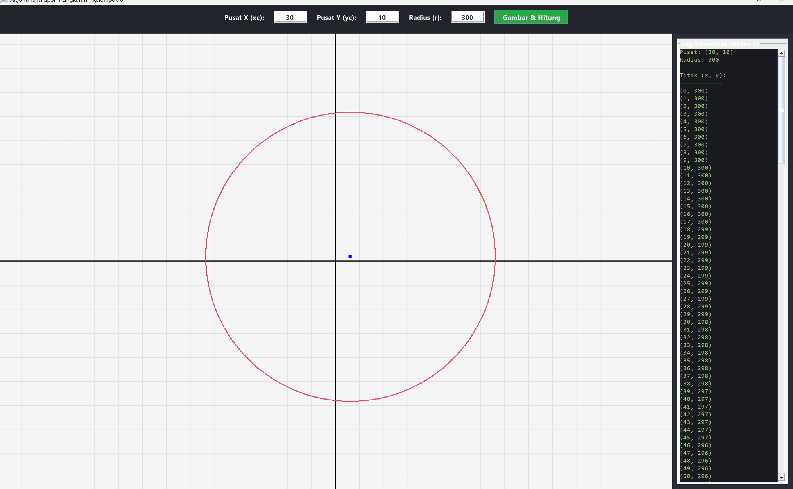
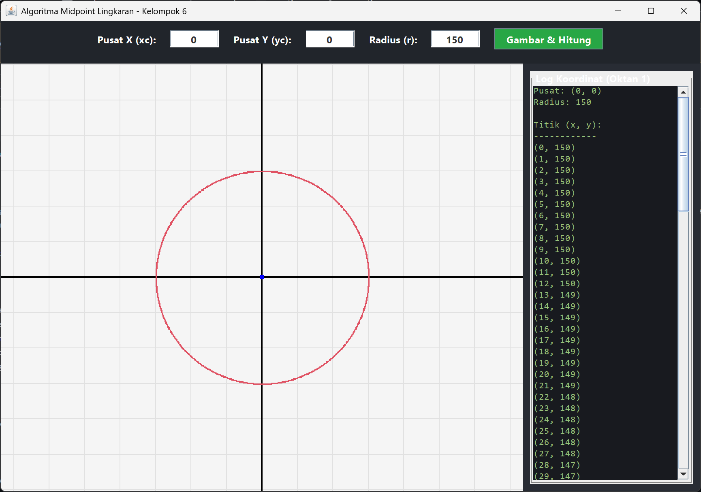

# 🎯 Midpoint Circle Algorithm - Visualizer


Repositori ini berisi implementasi algoritma **Midpoint Circle** menggunakan bahasa pemrograman **Java**. Aplikasi ini tidak hanya menggambar lingkaran berdasarkan perhitungan piksel matematis, tetapi juga menyediakan antarmuka grafis (GUI) interaktif bergaya modern.

Proyek ini dikembangkan untuk memenuhi **Tugas Kelompok** mata kuliah **Grafika Komputer**.

## ✨ Fitur Utama

- ✅ **Input Dinamis:** Pengguna dapat memasukkan koordinat Titik Pusat `(xc, yc)` dan Radius `(r)` secara bebas melalui panel input.
- ✅ **Interactive Panning (Draggable Canvas):** Kanvas gambar dapat digeser ke segala arah menggunakan *mouse drag* (tahan klik kiri dan geser) layaknya peta interaktif.
- ✅ **Sistem Grid Kartesius:** Dilengkapi dengan latar belakang *grid* (garis kotak-kotak) dan sumbu X/Y utama untuk memvalidasi posisi titik pusat secara visual.
- ✅ **Live Coordinate Logging:** Otomatis mencatat dan menampilkan titik koordinat `(x, y)` untuk Oktan 1 secara *real-time* di panel sisi kanan.
- ✅ **Modern UI/UX:** Antarmuka pengguna mengadopsi tema *Dark Mode* yang elegan dan responsif.

## 📸 Screenshots


> *Tampilan antarmuka utama dengan grid dan panel log koordinat.*


> *Demonstrasi kanvas yang dapat digeser untuk melihat lingkaran dengan radius besar di luar layar.*

## 🚀 Cara Menjalankan Program

Program ini ditulis menggunakan *library* standar bawaan Java (`javax.swing` dan `java.awt`), sehingga **tidak memerlukan library eksternal** tambahan.

### Prasyarat
- Java Development Kit (JDK) minimal versi 8 terinstal di komputermu.

### Langkah-langkah:
1. *Clone* repositori ini atau *download* sebagai ZIP.
2. Buka terminal/Command Prompt dan arahkan ke folder tempat file disimpan.
3. *Compile* kode Java:
   ```bash
   javac MidpointCircleSmooth.java


